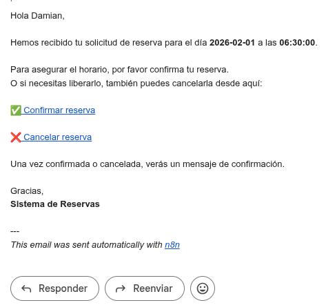

# Sistema de Reservas Simple (Backend + Automatización)

**[Live demo](https://reservation-system-kk8h.onrender.com/)** | **[Source code](https://github.com/HelberthGM/reservation_system_appointly)** | **[LinkedIn](https://www.linkedin.com/in/helberthgm/)**


## 📌 Descripción

Sistema de reservas sencillo y robusto para **servicios pequeños** (clases, consultorios, entrenadores, salas de reunión) que permite **crear, validar y cancelar reservas**, evitando conflictos de horario y enviando **notificaciones automáticas**.

El enfoque es **API-first** con automatización: el backend gestiona la lógica crítica y n8n se encarga de confirmaciones y flujos externos.

## 🚀 Demo en vivo

- 🔗 **API (Render)**: https://reservation-system-kk8h.onrender.com/

---

## 🎯 Problema que resuelve

Muchos negocios gestionan reservas manualmente (WhatsApp, Excel, Google Calendar), lo que genera:

* Doble reserva del mismo horario
* Errores humanos
* Falta de confirmaciones automáticas

Este sistema elimina esos problemas con reglas claras y automatización.

---

## ✅ Qué hace

* Crear reservas vía API
* Evitar doble reserva en el mismo horario
* Listar reservas por fecha
* Cancelar reservas
* Envía email de confirmación con opción de confirmar o cancelar la reserva

<!-- 
## ❌ Qué NO hace (por diseño)

* No gestiona pagos
* No incluye autenticación avanzada
* No maneja múltiples sedes
-->
> La confirmación y cancelación se realizan mediante **enlaces de un solo uso** basados en un `signed_id`.

---
## 🔄 Flujo de funcionamiento

1. El cliente crea una reserva vía API o formulario
2. El sistema valida disponibilidad y guarda la reserva
3. Se envía un email automático con opciones para confirmar o cancelar
4. El cliente confirma o cancela desde el email
5. El sistema valida el token y actualiza el estado
---

## 🧱 Arquitectura

```
Cliente / Formulario
        ↓
Backend API (Django REST Framework) — Render
        ↓
Base de datos (SQLite / PostgreSQL)
        ↓
n8n self-hosted — Railway
        ↓
Servicios externos (Brevo, Telegram*)
```
* Telegram planeado como mejora futura
---

## 🔌 Endpoints principales

### Crear reserva

```http
POST /reservations
```

**Body (JSON):**

```json
{
  "client_name": "Juan Perez",
  "client_email": "jperez@gmail.com",
  "date": "2026-01-20",
  "time": "10:00:00",
  "status": "pending"
}
```

<!-- ### Listar reservas por fecha

```http
GET /reservations?date=2026-01-15
``` -->

### Cancelar reserva

Cambia el estado de la reserva a 'Cancelado'

```http
POST /reservations/cancel/?signed_id=...
```

### Confirmar reserva

Cambia el estado de la reserva a 'Confirmado'

```http
POST /reservations/confirm/?signed_id=...
```
---

## 🧠 Reglas de negocio

* No se permiten dos reservas en la misma fecha y hora
* Todos los campos son validados antes de guardar
* El sistema responde rápido y procesa notificaciones en segundo plano

---

## 🤖 Automatización con n8n

La automatización está implementada usando **n8n self-hosted**, desplegado en **Railway** mediante contenedor Docker.

> Aunque n8n se ejecuta en Railway, sigue siendo **self-hosted** porque la instancia, datos y credenciales son controlados por el desarrollador, no por n8n Cloud.

### Funcionalidad actual

* Recepción de eventos vía Webhook desde la API desplegada en Render
* Envío de emails transaccionales usando **Brevo (API-first)**
* Confirmación y cancelación mediante enlaces firmados (`signed_id`)
* Manejo de errores de red y rebotes sin afectar la lógica principal

### Decisiones técnicas

* Separación de responsabilidades: API (Render) / Automatización (Railway)
* No se utiliza SMTP directo
* Credenciales cifradas usando `N8N_ENCRYPTION_KEY`
* Los emails se manejan como operación *best-effort*

---

## 📈 Estado del proyecto

✔ MVP funcional
✔ Backend estable
✔ Automatización integrada
✔ Confirmación segura con token de un solo uso

---

## 🔮 Mejoras planificadas

* 🔔 **Notificaciones por Telegram** como canal alternativo o de respaldo
* ⏰ **Recordatorios automáticos** antes de la reserva (Cron + n8n)
* 🔁 Reintentos controlados ante fallos de notificación
* 📊 Registro del estado de notificaciones (enviado, rebotado, fallido)

Estas mejoras no requieren cambios en el backend principal, demostrando un diseño desacoplado y extensible.

---

## 💼 Enfoque profesional

Proyecto desarrollado como **pieza de portafolio**, enfocado en demostrar:

* Diseño de APIs REST robustas
* Separación clara entre lógica de negocio y automatización
* Uso de servicios cloud (Render + Railway)
* Decisiones técnicas pragmáticas orientadas a escalabilidad

El sistema está preparado para evolucionar a producción con dominio propio, DKIM, autenticación, frontend dedicado y múltiples canales de notificación.

---
## 📸 Automatización (n8n)

A continuación se muestran capturas del flujo de automatización implementado en n8n, encargado de gestionar las notificaciones y acciones automáticas del sistema.

### Flujo principal

Este flujo se activa cuando se crea una nueva reserva:

1. Recibe los datos desde el backend mediante un Webhook

2. Construye el email de confirmación

3. Envía el correo al cliente con opciones para confirmar o cancelar la reserva

4. Maneja errores sin interrumpir el funcionamiento del backend


### Confirmación y cancelación de reservas



Al hacer clic en los enlaces del email:

1. n8n recibe la acción del cliente
2. Llama al endpoint correspondiente del backend
3. Envía una notificación final confirmando el estado de la reserva


### Manejo de errores y tolerancia a fallos (en desarrollo)

El flujo está diseñado para ser robusto:

* Si falta algún campo, el flujo continúa con valores por defecto
* Si un servicio externo falla (email, red), el backend no se ve afectado
* Los errores se controlan y registran dentro del flujo

## 📬 Contacto

Este proyecto forma parte de mi portafolio profesional como desarrollador backend.

- 💼 **LinkedIn**: [https://www.linkedin.com/in/helberthgm/](https://www.linkedin.com/in/helberthgm/)
- 🧑‍💻 **GitHub**: [https://github.com/HelberthGM](https://github.com/HelberthGM)
- ✉️ **Email**: hagarciadev@gmail.com

Estoy abierto a feedback técnico, oportunidades backend y proyectos freelance relacionados con automatización y sistemas cloud.

---
