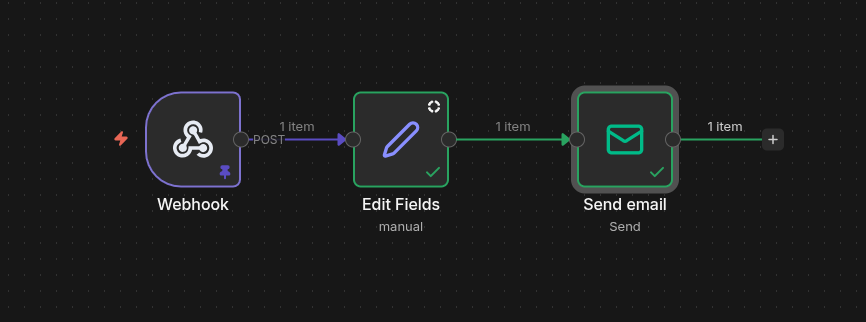

# Sistema de Reservas Simple (Backend + Automatización)

## 📌 Descripción

Sistema de reservas sencillo y robusto para **servicios pequeños** (clases, consultorios, entrenadores, salas de reunión) que permite **crear, validar y cancelar reservas**, evitando conflictos de horario y enviando **notificaciones automáticas**.

El enfoque es **API-first** con automatización: el backend gestiona la lógica crítica y n8n se encarga de confirmaciones y flujos externos.

---

## 🎯 Problema que resuelve

Muchos negocios gestionan reservas manualmente (WhatsApp, Excel, Google Calendar), lo que genera:

* Doble reserva del mismo horario
* Errores humanos
* Falta de confirmaciones automáticas

Este sistema elimina esos problemas con reglas claras y automatización.

---

## ✅ Qué hace

* Crear reservas vía API
* Evitar doble reserva en el mismo horario
* Listar reservas por fecha
* Cancelar reservas
* Envia email de confirmación con opción de confirmar o cancelar la reserva (via n8n)

<!-- 
## ❌ Qué NO hace (por diseño)

* No gestiona pagos
* No incluye autenticación avanzada
* No maneja múltiples sedes
-->
> Estas decisiones mantienen el sistema **simple, mantenible y fácil de adaptar**.

---
## 🔄 Flujo de funcionamiento

1. El cliente crea una reserva vía API o formulario
2. El sistema valida disponibilidad y guarda la reserva
3. Se envía un email automático con opciones para confirmar o cancelar
4. El cliente confirma o cancela desde el email
5. El sistema actualiza el estado y notifica automáticamente
---

## 🧱 Arquitectura

```
Cliente (Formulario / Postman / n8n)
        ↓
Backend API (Django REST Framework)
        ↓
Base de datos (SQLite / PostgreSQL)
        ↓
n8n (emails, recordatorios, automatización)
```

---

## 🔌 Endpoints principales

### Crear reserva

```http
POST /reservations
```

**Body (JSON):**

```json
{
  "client_name": "Juan Perez",
  "client_email": "jperez@gmail.com",
  "date": "2026-01-20",
  "time": "10:00:00",
}
```

### Listar reservas por fecha

```http
GET /reservations?date=2026-01-15
```

### Cancelar reserva

Cambia el estado de la reserva a 'Cancelado'

```http
POST /reservations/cancel/?signed_id=...
```

### Confirmar reserva

Cambia el estado de la reserva a 'Confirmado'

```http
POST /reservations/confirm/?signed_id=...
```
---

## 🧠 Reglas de negocio

* No se permiten dos reservas en la misma fecha y hora
* Todos los campos son validados antes de guardar
* El sistema responde rápido y procesa notificaciones en segundo plano

---

## 🤖 Automatización con n8n

* Recepción de reservas vía Webhook
* Envío de confirmación automática
* Manejo de errores sin romper el flujo
* Posibilidad de añadir recordatorios o integraciones (email, Google Sheets, Telegram)

---
## 🧪 Pruebas (en desarrollo)

* Probado usando Postman y Swagger UI
* Flujo probado con datos incompletos, campos faltantes y campos extra
* Manejo de errores controlado

---

## 🚀 Casos de uso

* Clases particulares
* Entrenadores personales
* Consultorios pequeños
* Reservas internas de salas

---
 
## 💼 Enfoque profesional

Este proyecto está pensado como **base vendible**, fácilmente adaptable a distintos negocios y escalable con:

* PostgreSQL
* Docker
* Autenticación
* Frontend dedicado

---

## 📈 Estado del proyecto

✔ MVP funcional
✔ Backend estable
✔ Automatización integrada

---
## 📸 Automatización (n8n)

A continuación se muestran capturas del flujo de automatización implementado en n8n, encargado de gestionar las notificaciones y acciones automáticas del sistema.

### Flujo principal

Este flujo se activa cuando se crea una nueva reserva:

1. Recibe los datos desde el backend mediante un Webhook

2. Construye el email de confirmación

3. Envía el correo al cliente con opciones para confirmar o cancelar la reserva

4. Maneja errores sin interrumpir el funcionamiento del backend



### Confirmación y cancelación de reservas (en desarrollo)

Al hacer clic en los enlaces del email:

1. n8n recibe la acción del cliente
2. Llama al endpoint correspondiente del backend
3. Envía una notificación final confirmando el estado de la reserva

### Manejo de errores y tolerancia a fallos (en desarrollo)

El flujo está diseñado para ser robusto:

* Si falta algún campo, el flujo continúa con valores por defecto
* Si un servicio externo falla (email, red), el backend no se ve afectado
* Los errores se controlan y registran dentro del flujo

## 📬 Contacto

Proyecto desarrollado como base para soluciones freelance de automatización y backend.

---